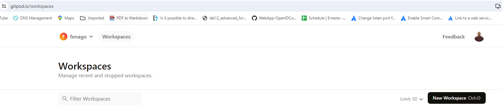
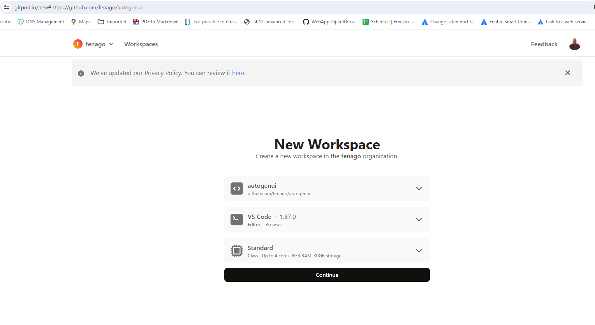
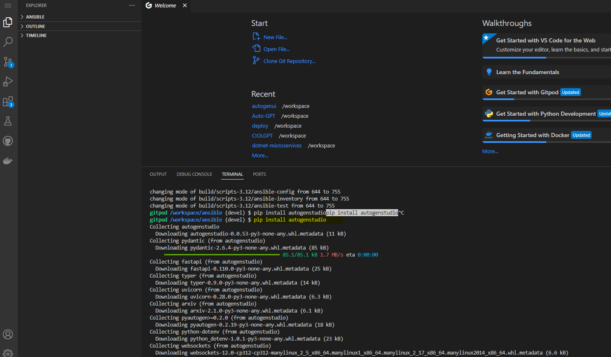
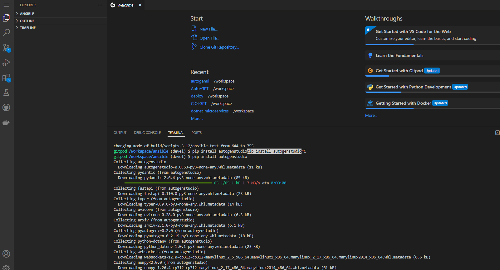
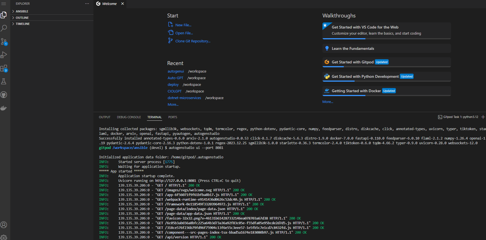
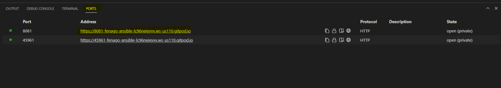

# AutoGen Studio

AutoGen Studio is an AutoGen-powered AI app (user interface) to help you rapidly prototype AI agents, enhance them with skills, compose them into workflows and interact with them to accomplish tasks. It is built on top of the [AutoGen](https://microsoft.github.io/autogen) framework, which is a toolkit for building AI agents.

### Open GitPod
Open `https://gitpod.io/` in the browser and login with github.

### 

Click `New Workspace` and select the github repo.



Make sure the select following and click **Continue**:






### Installation

**Install from PyPi**

With Python 3.10 or newer active in your virtual environment, use pip to install AutoGen Studio:

```bash
pip install autogenstudio
```



### Running the Application

Once installed, run the web UI by entering the following in your terminal:

```bash
autogenstudio ui --port 8081
```




This will start the application on the specified port. Open your web browser and go to `http://8081-GITPOD_URL/` to begin using AutoGen Studio. You can get the complete URL from **PORTS** tab.




Now that you have AutoGen Studio installed and running, you are ready to explore its capabilities, including defining and modifying agent workflows, interacting with agents and sessions, and expanding agent skills.
